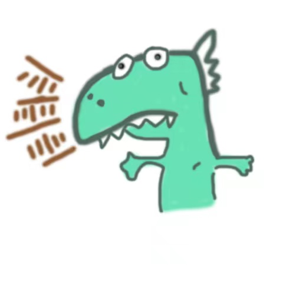

<picture>
  <source media="(prefers-color-scheme: dark)" srcset="https://github-stats.liuli.lol/api?username=Noah-Ywh&theme=vue-dark&show_icons=true&include_all_commits=true&count_private=true">
  
</picture>

Noah.

🔥 Tech Stack

